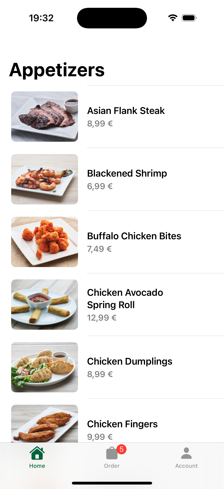

# Appetizers

Appetizers is a take-home app developed by @SAllen0400 that covers the basics of SwiftUI. It's a good project to learn how this framework works, API requests with async/await, MVVM architecture, reusable components, etc. You can watch the progress commit by commit or follow the tutorial I have left in the description of the project

<p float="left">

  


</p>

## API Reference

```http
  https://seanallen-course-backend.herokuapp.com/swiftui-fundamentals/appetizers
```
## Features

- Network calls
- Image server download
- Error handling and showing alerts
- Passing data
- Deleting items from a list
- Preserving data
- Form validation

## Installation

1. In your terminal run: `git clone https://github.com/Erikote04/Appetizers.git`
2. Open the project in Xcode
3. Build the project to see if anything fils with `Cmd+B`
4. Run the app in the simulator with `Cmd+R`
    
## Requirements

- Git command tools
- Computer with Xcode
- Xcode 16 & iOS 18
